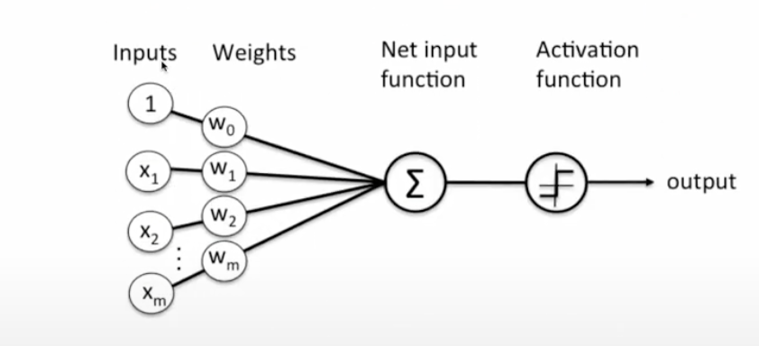
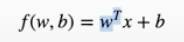
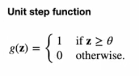
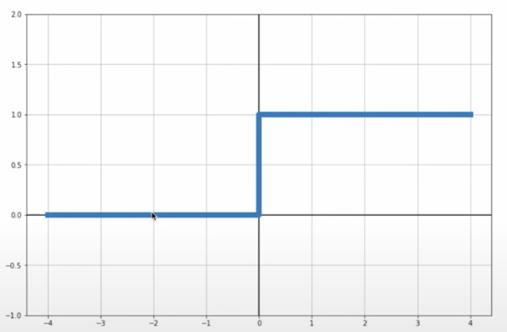
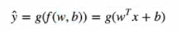
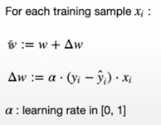
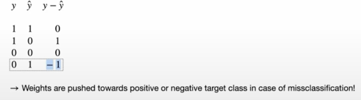

# Perceptron
Practice for perceptron, One single unit in a neural network, Simple model of a bio neuron (sims behavior of a single cell). Simple application works on only linear solutions

## Example of cells working

- inputs are multiplied by weights and sumed up.

## Linear Model

## Activation Function (For most simple case)

- if input is larger than 0 then output is 1 otherwise output == 0

## Approximation

- first apply linear model then the activation.
- second get the weights and bias

## Perceptron update rule

- new weight defined as old weight + the delta weight
- delta weight defined as alpha * (actual label - predicted label) * training sample
- alpha is learning rate between [0 and 1] (scaling factor)

### Update rule explained for a 2 class problem

