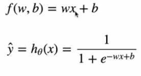
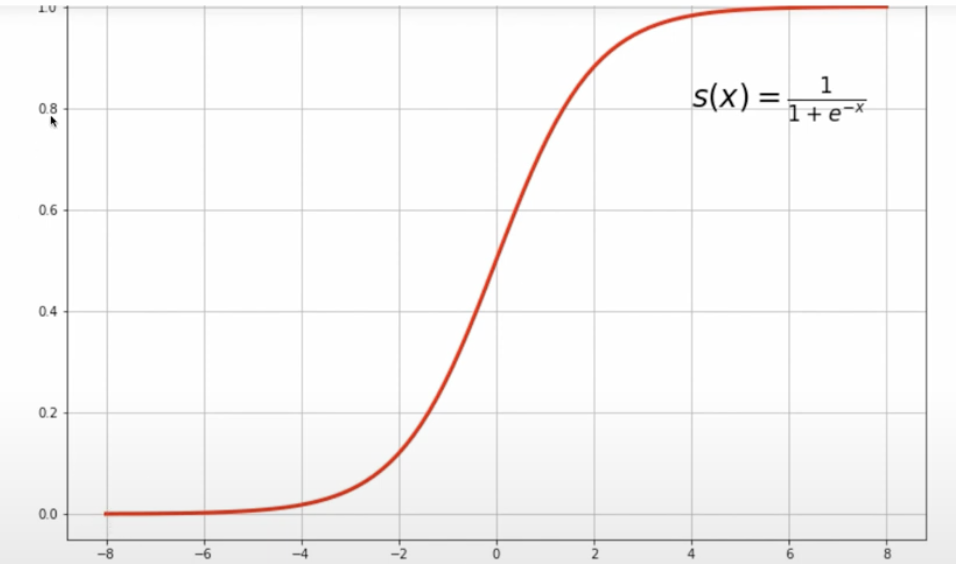
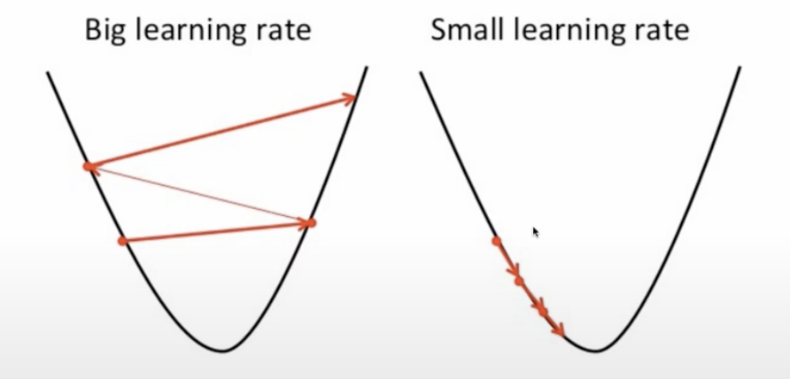
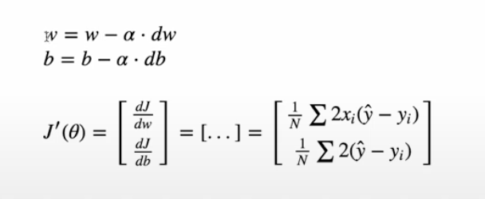

# Logistic-Regression
Practice for Logistic Regression
- Dont want continuous values but a probability

## Approximation

## Sigmoid Function

## Cost Function

## Gradient Decent

- Calculate derivative and go that direction until min is met

## Learning Rate 
- Determines how far you go in the direction each step
- Shouldnt be to high or to low

## Update Rules

- new weight = old weight - learning rate * derivative
- b = bias

