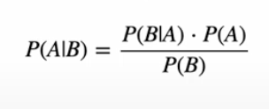
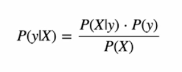
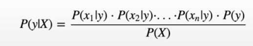
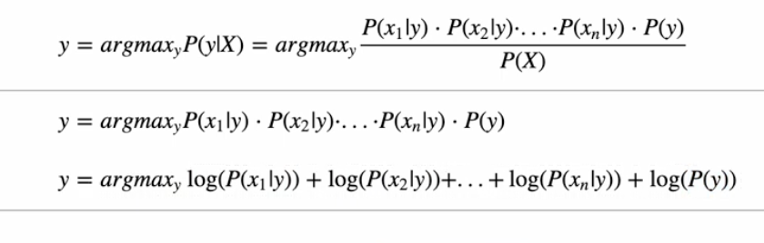
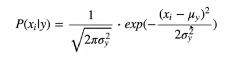
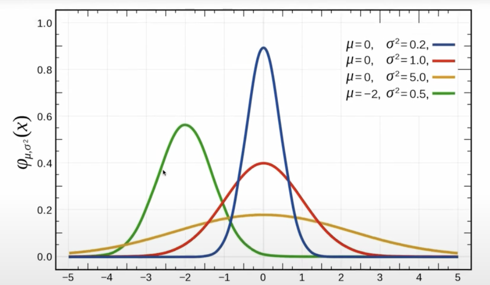

# Naive Bayes
Practice for Naive Bayes, Based on bayes theorem

## Bayes Theorem

- if we have two events A and B then the probability
of Event A and that B has happened is equal to the equation above
- P = probability | A,B = Events

### For our example 

- using feature vector X = (x1,x2,x3,.....xn)
- A feature is for example the sun is shining, the person is healthy
- make assumption all features are mutually independent

- Get probability for each feature

## Select class with the highest probability

## Prioe Probability P(y) : frequency

## class conditional probability P(x_i|y)

u=means, o = variance
