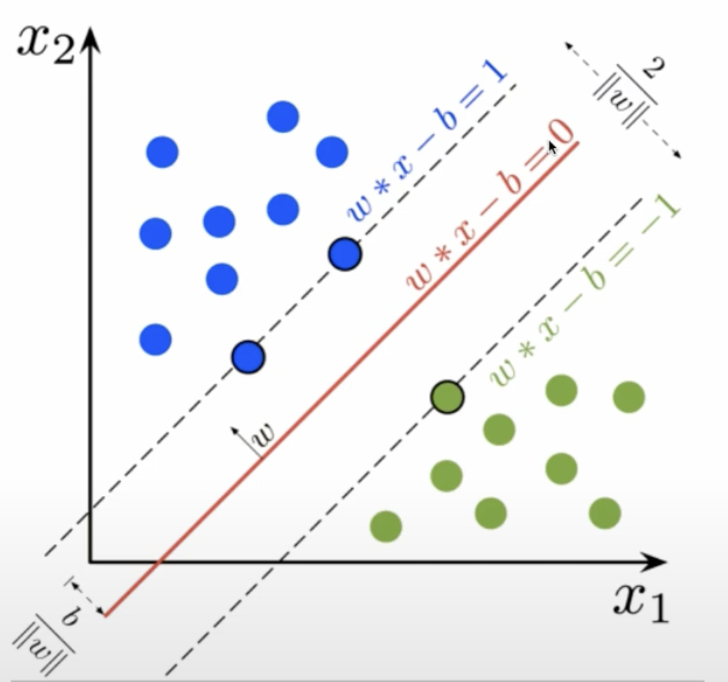
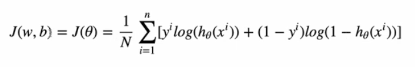
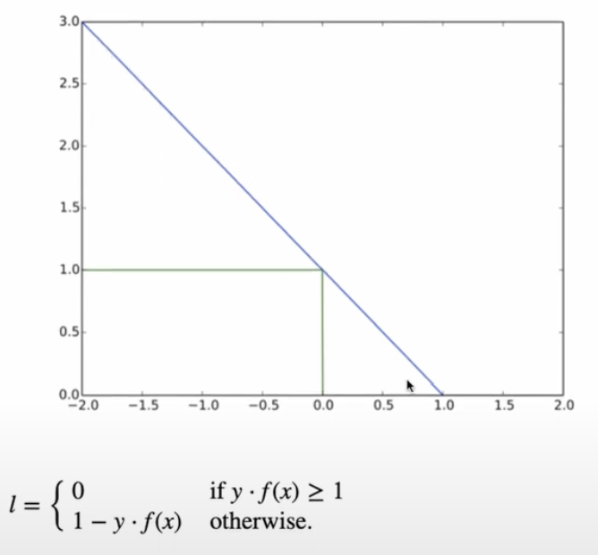
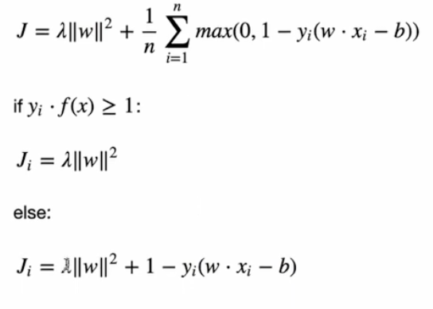
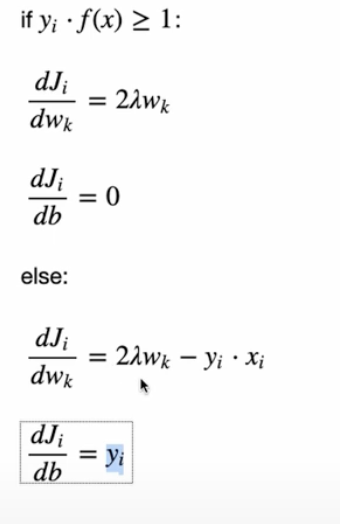

# SVM !Important
Practice for SVM model (Support Vector Machine).
- Follows linear model to find a linear decesion tree also called Hyper Plane. 
- Chooses the largest margin or seperation between two classes

## Linear Model

## Cost Function
### Hinge Loss

## Adding Regularization

- To minimize loss get gradient

## Gradients

## Update rule

