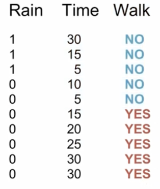
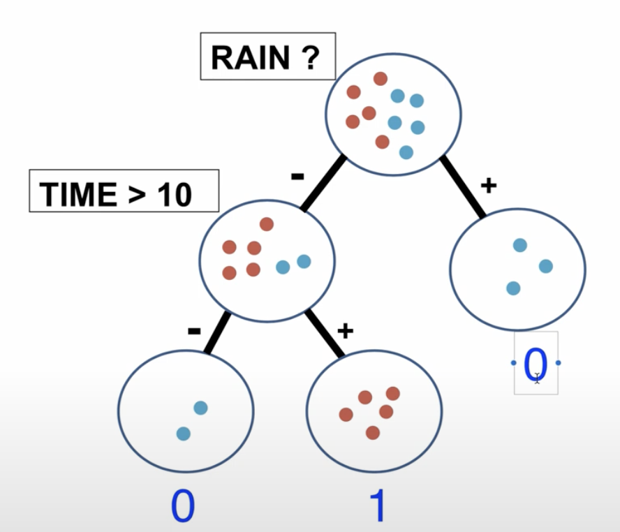
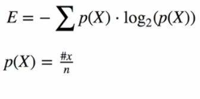
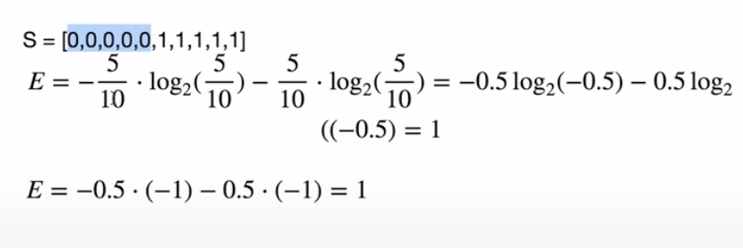
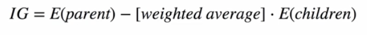
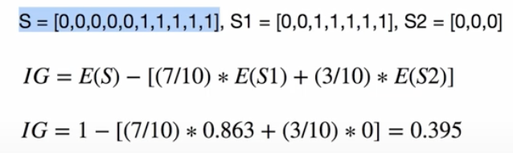

# Decision Tree
Practice for Decision Tree model. Idea = built tree that seperates data based on classes.

## Example of Model
- Data about a person walking. Rain, Walk are the feature. If they are walking is the class label.

- Sperate the data based on if they are walking, yes to the left and no to the right. Right node gets a class label of no. Then ask another question about if time is greater then 10. Splits the data again and gives labels. Can continue

- Goal is to find best split feature (split threshold)
- Leave nodes are the nodes on the bottom
- Apply most common label based on the test sample

## 1 Entropy
- Is measure of uncertainty

- p(X) is number of occurenaces over total number of samples

### Entropy Example

## 2 Information Gain

### Information Gain Example

## Approach
### Train Algorithim := Build the tree
- Start at the top node and at each node choose best split based on information gain
- Greedy search: Loop over all features and thresholds (All possible features)
- Save best split feature and threshold and each node
- build the tree recursively
- Apply some stopping crieteria (max depth, min samples at node, no more class distrubution in node)
- At leaf node store most common class label

### Predict := Traverse tree
- Traverse tree recursively
- At each node look at the best split feature of the feature vector(test) and go left or right (Depends on x\[feature_idx] <= threshold )
- Reaching the leaf node will return the stored most common class label

