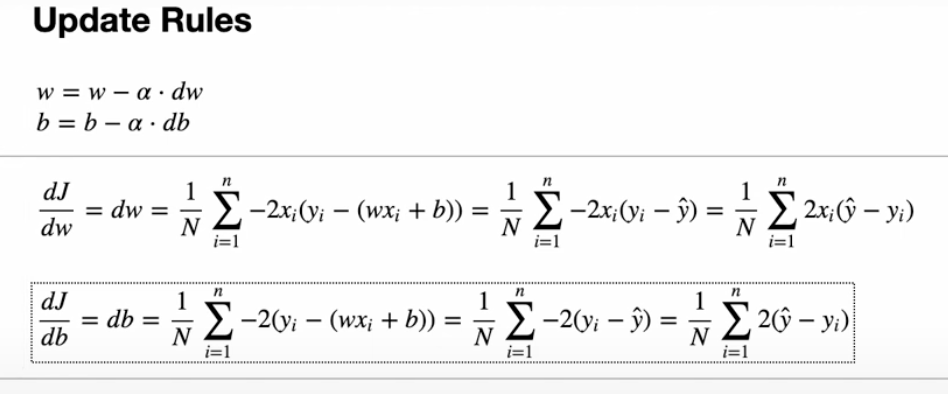

# Linear-Regression-Salary
regression: predict continuous values

## Approximation
y= wx + b
- w = weight/slope
- b = bias (the shift)

## Cost Func

- MSE = Mean Squared Error, How big the diff from actual and approximent value

## Gradient

### Gradient Descent

## Update Rules and derivatives

- old weight - learning rate * derivatives

## Learning Rate
